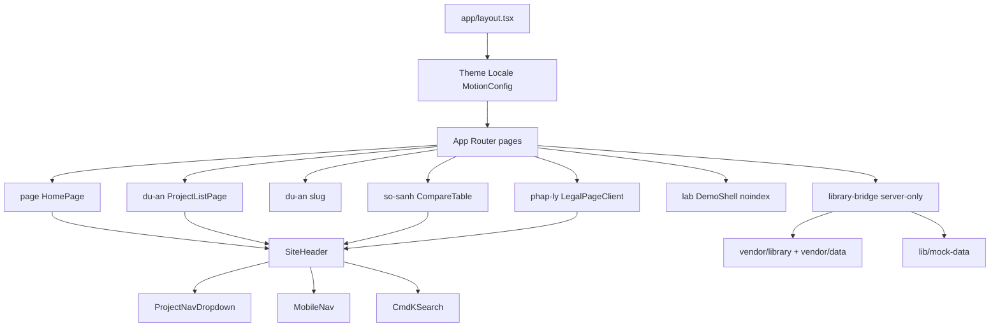
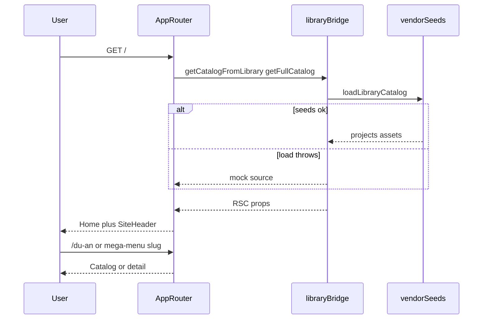
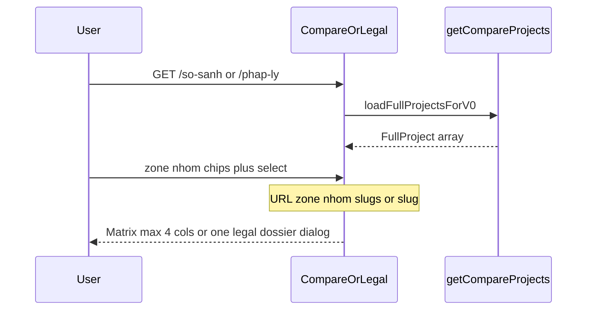

# DED-PMH — Source-First Audit

**Date:** 2026-08-12 (00:09 local; collision with `120826-audit/`)  
**Project:** DED-PMH  
**Root:** `Z:/Coding/260723-de-pmh`  
**Method:** Source-first (Layer 1→4). Docs not used as primary evidence.  
**Skill:** `source-first-product-audit` v1.2.0 (`@source-first-product-audit`)

---

## 0. One-sentence product verdict

A public Next.js App Router catalog for Phú Mỹ Hưng / Hồng Hạc: browse projects, compare up to four columns, and read legal dossier text from vendored seed JSON — no auth gate, no `app/api` writes, optional external PDF URL.

---

## 1. Purpose and users

### Actors

| Actor | Job (from code) | Citation |
|-------|-----------------|----------|
| Public visitor | Home, catalog, detail, Cmd+K, locale/theme | `[app/layout.tsx -> RootLayout]`, `[components/shared/site-header.tsx -> SiteHeader]` |
| Same visitor | Filter catalog by zone/group; open `/du-an/[slug]` | `[app/du-an/page.tsx -> ProjectListPage]`, `[components/project/project-explorer.tsx]` |
| Same visitor | Branch-matrix compare (`zone`/`nhom`/`slugs`, cap 4) | `[components/project/compare-table.tsx -> CompareTable]`, `[vendor/library/lib/data/compare-fields.ts -> COMPARE_COLUMN_CAP]` |
| Same visitor | Single-project legal panel (`?slug=`) + doc dialog | `[components/project/legal-page-client.tsx -> LegalScopedBody]`, `[components/project/legal-dossier-table.tsx]` |
| Internal demo user | Non-indexed lab shell | `[app/lab/page.tsx -> LabPage]` (`robots: { index: false }`) |
| Deploy/operator | Optional PDF Cloud Function; else print | `[components/project/detail/pdf-export-trigger.tsx -> exportFactSheetPdf]` |
| Authenticated admin | **Not implemented** | No `middleware.ts`; no auth deps in `[package.json -> dependencies]` |

### Constraints visible in code

- Data: vendored `@library` + `vendor/data/13_PROJECT_DATA_SCHEMA.json`, mock fallback on load failure `[lib/library-bridge.ts -> getCatalogFromLibrary]`.
- Build: `typescript.ignoreBuildErrors: true` `[next.config.mjs]`.
- Images: `unoptimized: true`; remote PMH / Hồng Hạc / Unsplash `[next.config.mjs -> images]`.
- Dev script: `next dev --webpack` `[package.json -> scripts.dev]`.
- Env keys referenced in code: `NEXT_PUBLIC_PDF_FUNCTION_URL`, `AUDIT_BASE_URL`, `PROD_BASE_URL`, `LUXURY_MIN_INDEX`, `CI`, `NODE_ENV`, `NEXT_RUNTIME` (values not audited).
- Mobile IA for zone/group hierarchy explicitly deferred `[components/shared/mobile-nav.tsx -> MobileNav` comment].

---

## 2. Feature inventory

Only features with executable code.

| Feature | Where in UI | Citation | Notes |
|---------|-------------|----------|-------|
| Home: hero, featured, explorer preview, map, timeline, legal teaser, updates | `/` | `[app/page.tsx -> HomePage]` | No StatStrip in this page import list |
| Site chrome: sticky header, footer, toaster | Most routes | `[site-header.tsx]`, `[app/layout.tsx -> SiteFooter]` | |
| Desktop mega-menu Dự án (Bắc / Nam → Site A \| Outsite) + coming soon | Header | `[project-nav-dropdown.tsx]`, `[lib/project-nav-taxonomy.ts -> ProjectNavLeaf]` | |
| Mobile flat project list in Dialog | Header &lt;1024 | `[mobile-nav.tsx -> MobileNav]` | Hierarchy deferred |
| Cmd+K search | Header | `[components/shared/cmdk.tsx]` via `[site-header.tsx]` | Ctrl/Cmd+K |
| Catalog explorer (search/filter/sort/zone chips) | `/du-an` | `[project-explorer.tsx]` | |
| Project detail + PDF/print trigger | `/du-an/[slug]` | `[app/du-an/[slug]/page.tsx]`, `[pdf-export-trigger.tsx]` | |
| Compare matrix | `/so-sanh` | `[compare-table.tsx]` | URL-driven |
| Legal dossiers | `/phap-ly` | `[legal-page-client.tsx]`, `[lib/legal-documents.ts]` | |
| Lab / DemoShell | `/lab` | `[app/lab/page.tsx]`, `[components/demo-shell.tsx]` | `noindex` |
| Locale VI/EN | Header switcher | `[lib/i18n/locale-context.tsx]` | Client |
| Theme system | Root | `[app/layout.tsx -> ThemeProvider]` | |
| MapLibre region map | Home | `[components/home/vn-map.tsx]`, `[region-map-canvas.tsx]` | |
| Luxury QA + Playwright | CLI | `[package.json -> luxury:*|test:e2e]` | Not user-facing |
| Vercel Analytics | Prod only | `[app/layout.tsx -> Analytics]` | |

### Destructive ops

- **Reset / purge / replace import:** none coded (read-only product surface).

---

## 3. Frontend architecture

- **Stack:** Next 16.2.6, React 19.2.4, Tailwind 4, Framer Motion, MapLibre, cmdk, next-themes, sonner `[package.json -> dependencies]`.
- **Routing:** File-based App Router; **no middleware** / rewrite gate.
- **State:** URL search params for compare/legal/catalog filters; React local state for dialogs; `LocaleProvider` context; no Redux/Zustand/Query.
- **Notable UX:** Fraunces + Inter `[app/fonts.ts]`; teal OKLch tokens `[app/globals.css -> :root]`; sitewide `reducedMotion="user"` `[app/layout.tsx -> MotionConfig]`.

---

## 4. Backend / server architecture

| Layer | Role | Citation |
|-------|------|----------|
| Client / server | RSC pages + `"server-only"` bridge; interactive `"use client"` tables | `[lib/library-bridge.ts]`, compare/legal clients |
| Auth / rules | Absent | No `firestore.rules` / `storage.rules` / middleware |
| Data stores | Filesystem seeds via alias `@library` → `./vendor/library` | `[next.config.mjs -> resolveAlias]`, `[seed-adapter` via bridge]` |
| HTTP API in-app | None | Glob `app/api/**` empty |
| External optional | Browser `fetch` to PDF function URL | `[pdf-export-trigger.tsx -> exportFactSheetPdf]` |
| Leftover debug | Periodic + render-time POSTs to `127.0.0.1:7465` | `[instrumentation.ts -> register]`, `[app/page.tsx]`, `[region-map-canvas.tsx]` |

### Write patterns

- N/A for server mutations. Client clipboard copy on legal rows only `[legal-dossier-table.tsx]`.

---

## 5. End-to-end flows

### Flow 1 — Primary browse path

### Flow 2 — Compare / legal (no admin path)

---

## 6. UI/UX 8-point audit

Scored for public catalog at **current seed scale** (~4 projects; taxonomy anticipates more). Not a 1k-row admin grid.

### 01 Point of view — **Strong** · Risk **2/5**

- **Evidence:** Product titles/descriptions center DED-PMH project info `[app/page.tsx -> metadata]`, `[app/du-an/page.tsx -> metadata]`; brand wordmark `[site-header.tsx]`; teal brand `[globals.css -> --primary]`.
- **Risk:** `package.json` name `my-project`; `metadata.generator: "v0.app"` `[app/layout.tsx]` — tooling/SEO crumb mismatch.
- **Recommendation:** Rename package; drop v0 generator string.

### 02 Typography — **Strong** · Risk **1/5**

- **Evidence:** Inter body + Fraunces display with Vietnamese subsets `[app/fonts.ts]`; page H1s use `font-display` `[du-an/page.tsx]`, `[so-sanh/page.tsx]`.
- **Risk:** Low drift if new screens omit `font-display`.
- **Recommendation:** Keep one display + one body; lint or convention for H1.

### 03 Color — **Strong** · Risk **2/5**

- **Evidence:** Documented teal OKLch system light/dark `[globals.css]`; amber mock banner `[du-an/page.tsx]`.
- **Risk:** Dark mode + photo galleries / map may fail contrast.
- **Recommendation:** Contrast pass on legal dialog + map chrome in dark theme.

### 04 Hierarchy — **Mixed** · Risk **3/5**

- **Evidence:** Home composes many sequential sections `[app/page.tsx]` imports; compare/legal use clear H1 + one job; mega-menu hierarchical with catalog CTA.
- **Risk:** Home first viewport can feel multi-purpose; mobile misses zone/group hierarchy `[mobile-nav.tsx` deferred comment].
- **Recommendation:** Port taxonomy accordion to mobile; keep home hero budget tight.

### 05 Imagery and empty states — **Mixed** · Risk **2/5**

- **Evidence:** Verified-thumb preference `[library-bridge.ts -> buildThumbBySlug]`; coming-soon labels in mega-menu; mock-source banner; `ImageWithFallback` in mobile nav.
- **Risk:** `images.unoptimized: true`; Unsplash hostname allowed `[next.config.mjs]`.
- **Recommendation:** Prefer verified PMH hosts; plan optimization later.

### 06 Motion — **Strong** · Risk **2/5**

- **Evidence:** `MotionConfig reducedMotion="user"` `[layout.tsx]`.
- **Risk:** Agent-log side effects on map canvas mount may co-exist with map init `[region-map-canvas.tsx]`.
- **Recommendation:** Remove debug regions; keep MotionConfig as sole policy.

### 07 Mobile — **Mixed** · Risk **3/5**

- **Evidence:** Accessible Dialog mobile nav `[mobile-nav.tsx]`; compare Accordion patterns `[compare-table.tsx` imports]; legal single-project reduces stack height.
- **Risk:** Flat mobile project list vs desktop IA; wide attribute tables on small screens.
- **Recommendation:** Implement deferred mobile hierarchy; keep column cap 4.

### 08 The invisible expensive stuff — **Weak** · Risk **4/5**

- **Evidence:**
  - `ignoreBuildErrors: true` `[next.config.mjs]` — deploy despite TS errors.
  - Debug ingest from home RSC, instrumentation interval (12×5s), and map canvas `[app/page.tsx]`, `[instrumentation.ts -> register]`, `[region-map-canvas.tsx]`.
  - Silent mock fallback can ship wrong data `[library-bridge.ts -> catch]`.
  - Full asset arrays into home props — OK at N≈4; watch growth.
- **Risk:** False-green builds; failed localhost fetches in prod; wrong catalog if vendor missing on Vercel.
- **Recommendation:** Strip agent logs; CI typecheck; production fail-closed or hard banner for `source==="mock"`.

---

## 7. Priority fix list

### P0 — Defects and technical debt

| ID | Issue | Citation | Fix direction |
|----|-------|----------|---------------|
| P0-1 | Leftover agent debug POSTs to `127.0.0.1:7465` (home + instrumentation timer + map) | `[expected clean render]` vs `[app/page.tsx -> agent log]`, `[instrumentation.ts -> register]`, `[region-map-canvas.tsx]` | Delete all `#region agent log` blocks |
| P0-2 | TypeScript errors ignored at build | `[expected typecheck gate]` vs `[next.config.mjs -> ignoreBuildErrors true]` | Set false; fix errors; add CI `tsc` |
| P0-3 | Production may serve mock catalog when vendor load fails | `[expected library-only prod]` vs `[library-bridge.ts -> catch mock]` | Prod: throw / error UI; mock only in development |

### P1 / P2 — Design and polish

| Priority | Improvement | Impact | Cost |
|----------|-------------|--------|------|
| P1 | Mobile zone/group IA (deferred in comment) | Parity with desktop findability | Medium |
| P1 | Remove `generator: "v0.app"`; rename `my-project` | Brand/tooling hygiene | Low |
| P1 | Confirm `/lab` stays unlinked from public nav | Avoid demo leakage | Low |
| P2 | Next image optimization when CDN ready | LCP | Medium |
| P2 | Dark-theme contrast on legal dialog + map | a11y | Low |
| P2 | Home section budget (first viewport one job) | Hierarchy | Medium |

---

## 8. Non-goals and unknown

- Not proven from code: live Vercel env values, whether PDF function is deployed, production seed freshness vs monorepo sync date.
- Doc-only (not primary): `docs/PDF_EXPORT.md`, CLAUDE.md GitHub identity rules.
- No Firebase/Firestore/Supabase rules files present.
- Prior stamp folder `120826-audit/` already existed → this run used collision path `120826-0009-audit/`.

---

## Layer completion stamp

| Layer | Status | Files read |
|-------|--------|------------|
| 1 Skeleton | Full | `package.json`, `next.config.mjs`, `app/layout.tsx`, `app/fonts.ts`, `app/globals.css`, `instrumentation.ts`, lock/scripts |
| 2 Routing & Gate | Full | All `app/**/page.tsx` (home, du-an, slug, so-sanh, phap-ly, lab); no middleware; no firestore/storage rules; env key grep |
| 3 State & Data | Full | `lib/library-bridge.ts`, `lib/project-nav-taxonomy.ts`, `lib/legal-documents.ts` (via legal client), `vendor/library/lib/data/compare-fields.ts`, vendor data schema present |
| 4 UI & Logic | Full for primary surfaces | Header, mobile-nav, mega-menu, compare-table, legal-page-client, legal-dossier-table, pdf-export-trigger, region-map-canvas (debug), project list page |

**Deferred paths:** Exhaustive line-by-line of every `components/project/detail/*` submodule; full Playwright suite body; luxury script internals beyond env keys.

---

## Related artifacts

| Artifact | Location |
|----------|----------|
| Skill (personal) | `C:\Users\Kieu Oanh\.cursor\skills\source-first-product-audit\` |
| Skills repo | https://github.com/howtodonextcom-art/260810-skills |
| This audit | `Z:/Coding/260723-de-pmh/120826-0009-audit/source-first-audit.md` |
| Earlier same-day audit | `Z:/Coding/260723-de-pmh/120826-audit/source-first-audit.md` |
