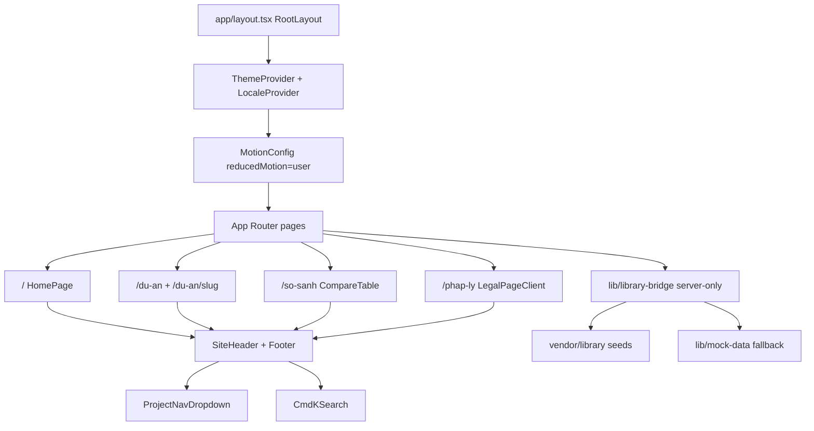
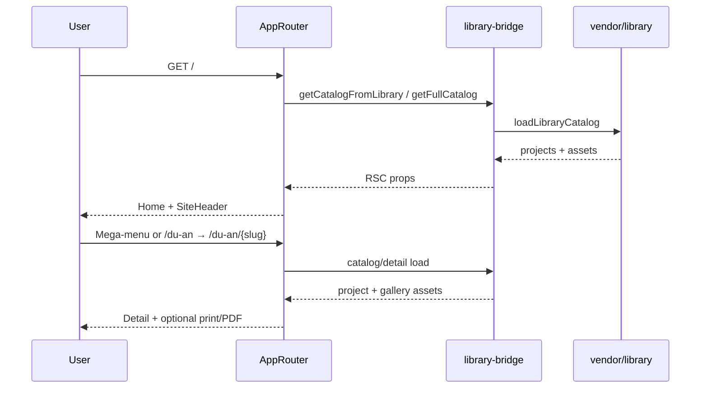
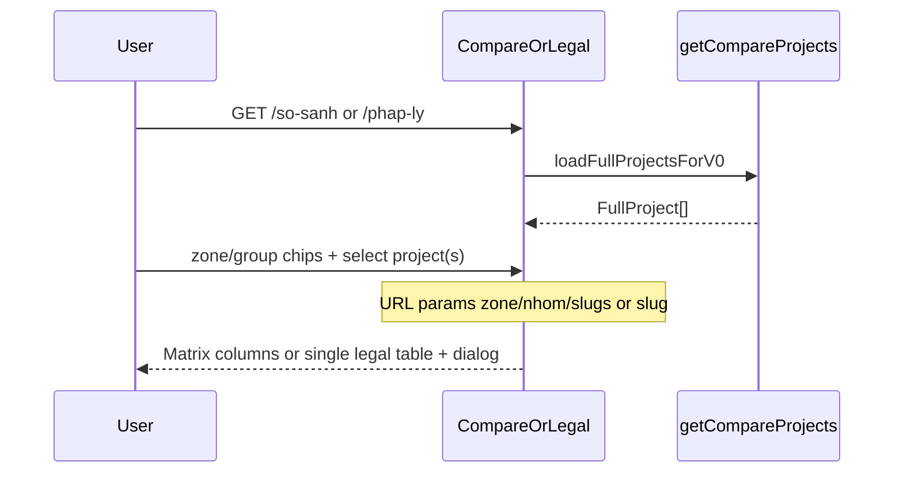

# DED-PMH — Source-First Audit

**Date:** 2026-08-12  
**Project:** DED-PMH (package name still `my-project`)  
**Root:** `Z:/Coding/260723-de-pmh`  
**Method:** Source-first (Layer 1→4). Docs not used as primary evidence.

---

## 0. One-sentence product verdict

A public Next.js brochure/catalog for Phú Mỹ Hưng / Hồng Hạc projects: browse, compare fields, and read legal dossier text from vendored seed JSON — no auth, no write APIs, no live backend in this repo.

---

## 1. Purpose and users

### Actors

| Actor | Job (from code) | Citation |
|-------|-----------------|----------|
| Public visitor (default locale VI) | Browse home, catalog, project detail; open Cmd+K search | `[app/layout.tsx -> RootLayout]`, `[components/shared/site-header.tsx -> SiteHeader]` |
| Same visitor | Compare ≤4 projects via zone/group + URL `slugs` | `[app/so-sanh/page.tsx -> ComparePage]`, `[components/project/compare-table.tsx]` |
| Same visitor | Open one legal project at a time (`?slug=`), view per-doc text in dialog | `[app/phap-ly/page.tsx -> LegalPage]`, `[components/project/legal-page-client.tsx]` |
| Operator / deploy | Optional PDF Cloud Function via `NEXT_PUBLIC_PDF_FUNCTION_URL`; else print fallback | `[components/project/detail/pdf-export-trigger.tsx -> exportFactSheetPdf]` |
| No coded admin / authenticated actor | — | No `middleware.ts`, no `app/api/**`, no Firebase/auth deps in `[package.json -> dependencies]` |

### Constraints visible in code

- Catalog and compare/legal data load from vendored `@library` seeds with silent mock fallback `[lib/library-bridge.ts -> getCatalogFromLibrary|getCompareProjects]`.
- TypeScript build errors ignored `[next.config.mjs -> typescript.ignoreBuildErrors]`.
- Images unoptimized; remote hosts limited to PMH / Hồng Hạc / Unsplash `[next.config.mjs -> images]`.
- Dev must use webpack (`next dev --webpack`) `[package.json -> scripts.dev]`.
- Sitewide reduced-motion via Framer `MotionConfig` `[app/layout.tsx -> MotionConfig]`.
- Nav IA includes live slugs plus non-link “coming soon” leaves `[lib/project-nav-taxonomy.ts -> ProjectNavLeaf.slug?]`.

---

## 2. Feature inventory

Only features with executable code. No inference from filenames alone.

| Feature | Where in UI | Citation | Notes |
|---------|-------------|----------|-------|
| Home hero + featured + explorer preview + VN map + timeline + legal teaser + updates | `/` | `[app/page.tsx -> HomePage]` | Server-loaded catalog |
| Sticky header: wordmark, Dự án mega-menu, So sánh, Pháp lý, Cmd+K, locale, mobile sheet | All pages with header | `[components/shared/site-header.tsx -> SiteHeader]` | |
| Desktop hierarchical project mega-menu (Bắc / Nam → Site A \| Outsite) | Header “Dự án” | `[components/shared/project-nav-dropdown.tsx]`, `[lib/project-nav-taxonomy.ts]` | Placeholders via `nav.comingSoon` |
| Project catalog + zone/group filters + chips | `/du-an` | `[app/du-an/]` + explorer/filter clients | Contextual CTA from mega-menu |
| Project detail (gallery, masterplan scroll, PDF export trigger, etc.) | `/du-an/[slug]` | `[app/du-an/[slug]/]`, `[components/project/detail/]` | |
| Branch-matrix compare (zone/group chips, ≤4 columns, URL state) | `/so-sanh` | `[components/project/compare-table.tsx]` | |
| Legal dossiers: zone scope, single project tabs, per-doc lines, large dialog viewer | `/phap-ly` | `[components/project/legal-dossier-table.tsx]`, `[lib/legal-documents.ts]` | Text viewer; empty scan honesty |
| Locale switcher (VI/EN strings) | Header | `[components/shared/locale-switcher.tsx]`, `[lib/i18n/]` | Client context |
| Theme (light/dark/system) | Root | `[app/layout.tsx -> ThemeProvider]` | |
| Print button / print CSS paths | Legal + PDF fallback | `[components/shared/print-button.tsx]`, `[pdf-export-trigger.tsx]` | |
| Vercel Analytics (prod only) | Root | `[app/layout.tsx -> Analytics]` | |
| Luxury QA scripts (capture/diff/score) | CLI only | `[package.json -> luxury:*]` | Not end-user UI |
| Playwright e2e | CLI | `[package.json -> test:e2e]` | |

### Destructive ops (if present — keep distinct)

- **Reset ops:** none coded.
- **Purge / delete:** none coded.
- **Replace import:** none coded (read-only seed load).

---

## 3. Frontend architecture

- **Stack:** Next 16.2.6, React 19.2.4, Tailwind 4, Framer Motion, MapLibre, cmdk, Base UI / shadcn-style UI, next-themes, sonner `[package.json -> dependencies]`.
- **Routing:** App Router file routes only; **no** `middleware.ts` (auth/rewrite gate absent).
- **State:** URL search params for compare/legal filters; React client state for menus/dialogs; no global client store; server components call `getCatalogFromLibrary` / `getCompareProjects` / `getFullCatalog`.
- **Notable UX:** Editorial teal brand tokens + Fraunces display / Inter body `[app/globals.css -> :root]`, `[app/fonts.ts]`; honest mock banner when library missing `[app/so-sanh/page.tsx]`.

---

## 4. Backend / server architecture

| Layer | Role | Citation |
|-------|------|----------|
| Client / server boundary | RSC pages + `"server-only"` bridge; heavy UI is `"use client"` | `[lib/library-bridge.ts]`, page servers under `app/` |
| Auth / rules | None in-repo | No middleware / API / Firebase |
| Data stores | Filesystem JSON/CSV via `@library` alias → `vendor/library` (+ `vendor/data`) | `[next.config.mjs -> resolveAlias.@library]`, `[library-bridge.ts -> loadLibraryCatalog]` |
| Optional external | PDF function URL (browser fetch) | `[pdf-export-trigger.tsx -> exportFactSheetPdf]` |
| Observability leftover | Debug ingest to `127.0.0.1:7465` from instrumentation + home | `[instrumentation.ts -> register]`, `[app/page.tsx -> HomePage agent log]` |

### Write patterns

- Confirm-once / idempotent / multi-write: **N/A** — product is read-only for end users. Clipboard copy on legal lines is client-local only `[legal-dossier-table.tsx]`.

---

## 5. End-to-end flows

### Flow 1 — Primary user path (browse → detail)

### Flow 2 — Compare / legal (no admin path coded)

---

## 6. UI/UX 8-point audit

Scored for a **public catalog at small scale** (~4 live projects in seeds; nav taxonomy anticipates more). Not a 1k-row admin grid.

### 01 Point of view — **Strong** · Risk **2/5**

- **Evidence:** Metadata and home copy position DED-PMH as project info / legal lookup for PMH portfolio `[app/page.tsx -> metadata]`, `[app/layout.tsx -> metadata]`. Brand wordmark in sticky header `[site-header.tsx]`. Teal editorial tokens `[globals.css -> --primary]`.
- **Risk:** `package.json` still named `my-project`; layout `generator: "v0.app"` `[layout.tsx -> metadata.generator]` weakens product identity in tooling/SEO crumbs.
- **Recommendation:** Align package name / generator with DED-PMH; keep hero brand-first (already directionally strong).

### 02 Typography — **Strong** · Risk **1/5**

- **Evidence:** Fraunces display + Inter with Vietnamese subsets `[app/fonts.ts]`; `font-display` on page H1s `[so-sanh/page.tsx]`, `[phap-ly/page.tsx]`.
- **Risk:** Low; ensure all major H1s stay on display family consistently.
- **Recommendation:** Keep body on Inter; avoid adding a third family.

### 03 Color — **Strong** · Risk **1/5**

- **Evidence:** Defined light (and dark via theme) OKLch teal system `[globals.css -> :root]`; mock-source amber banner is intentional honesty `[so-sanh/page.tsx]`.
- **Risk:** Dark mode is enabled system-wide; catalog imagery may need contrast checks on dark chrome.
- **Recommendation:** Spot-check gallery/legal dialog contrast in dark theme.

### 04 Hierarchy — **Mixed** · Risk **3/5**

- **Evidence:** Home stacks many sections (hero, featured, explorer, map, timeline, legal teaser, updates) `[app/page.tsx]` — one composition risk vs “dashboard of sections.” Nav mega-menu is hierarchical and capped with catalog CTA (good IA). Legal is single-project (good focus).
- **Risk:** First viewport may compete between brand and multiple home modules; mobile mega-menu hierarchy not mirrored (desktop-only taxonomy).
- **Recommendation:** Keep mobile nav honest flat list or promote same zone/group IA; trim home section count if first-viewport clarity slips.

### 05 Imagery and empty states — **Mixed** · Risk **2/5**

- **Evidence:** Thumb resolution prefers verified assets `[library-bridge.ts -> buildThumbBySlug]`; coming-soon leaves labeled `[project-nav-dropdown.tsx -> nav.comingSoon]`; legal viewer documents empty scan honestly (per recent legal refactor + e2e). Mock fallback banner when seeds missing.
- **Risk:** `images.unoptimized: true` skips Next image pipeline `[next.config.mjs]`; Unsplash allowed — risk of non-portfolio filler if seeds drift.
- **Recommendation:** Prefer verified PMH hosts; plan optimization when CDN strategy exists.

### 06 Motion — **Strong** · Risk **1/5**

- **Evidence:** Sitewide `MotionConfig reducedMotion="user"` `[layout.tsx]`; map/reveal patterns under Framer.
- **Risk:** Orphan / leftover ticker utilities if unused after StatStrip removal (file may still exist under `components/shared/`).
- **Recommendation:** Delete dead motion widgets; keep MotionConfig as single policy.

### 07 Mobile — **Mixed** · Risk **3/5**

- **Evidence:** `MobileNav` dialog exists `[components/shared/mobile-nav.tsx]`; horizontal snap/overflow patterns on explorer/masterplan; compare historically accordion-oriented on small screens.
- **Risk:** Desktop mega-menu IA (zone → group → leaf) not fully reflected in mobile sheet; wide tables (compare/legal) remain hard on narrow viewports.
- **Recommendation:** Port taxonomy to mobile; keep compare column cap and legal single-project as mobile-friendly constraints.

### 08 The invisible expensive stuff — **Weak** · Risk **4/5**

- **Evidence:**
  - `typescript.ignoreBuildErrors: true` `[next.config.mjs]` — ships despite type failures.
  - Agent debug `fetch` to local ingest on **every home render** and instrumentation interval `[app/page.tsx]`, `[instrumentation.ts]` — noise, failed requests in prod, possible memory timer leak pattern.
  - No auth needed for public data, but also no rate-limiting surface (static); PDF URL is public env.
  - Full catalog loaded into RSC props for home (assets + projects) — fine at N≈4, watch at larger N.
- **Risk:** Build false confidence; leftover debug instrumentation in production path; silent mock data if vendor seeds break.
- **Recommendation:** Remove agent-log regions; turn off `ignoreBuildErrors` or gate CI; fail closed or banner louder if `source === "mock"` in production.

---

## 7. Priority fix list

### P0 — Defects and technical debt

| ID | Issue | Citation | Fix direction |
|----|-------|----------|---------------|
| P0-1 | Debug instrumentation posts to `127.0.0.1:7465` from home RSC + `instrumentation` timer | `[app/page.tsx -> agent log]` vs expected clean server render; `[instrumentation.ts -> register]` | Delete `#region agent log` blocks and interval; keep instrumentation empty or prod-safe only |
| P0-2 | `ignoreBuildErrors: true` hides type breakage from deploy | `[next.config.mjs -> typescript.ignoreBuildErrors]` vs expected `false` / CI `tsc` | Enable typecheck in CI; remove ignore once clean |
| P0-3 | Production can silently serve mock catalog if vendor load throws | `[library-bridge.ts -> catch → mock]` vs expected fail or hard banner in prod | In `NODE_ENV===production`, prefer throw/error UI over mock (keep mock for local only) |

### P1 / P2 — Design and polish

| Priority | Improvement | Impact | Cost |
|----------|-------------|--------|------|
| P1 | Mirror project zone/group IA in `MobileNav` | Mobile findability matches desktop | Medium |
| P1 | Remove `generator: "v0.app"`; rename package `my-project` → `de-pmh` / `ded-pmh` | Brand/tooling hygiene | Low |
| P1 | Audit orphan files after StatStrip kill (`number-ticker` if unused) | Bundle/clarity | Low |
| P2 | Re-enable Next image optimization when remote CDN policy is stable | Perf/LCP | Medium |
| P2 | Dark-theme contrast pass on legal dialog + map | a11y | Low |
| P2 | Home section budget: ensure first viewport stays brand + one job | Hierarchy | Medium |

---

## 8. Non-goals and unknown

- Not proven from code: live Vercel project wiring, production seed freshness vs monorepo sync, exact live project count on deployed URL, whether `NEXT_PUBLIC_PDF_FUNCTION_URL` is set in prod.
- Doc-only (if cross-checked): `docs/PDF_EXPORT.md`, CLAUDE.md deploy identity rules — not used as primary evidence above.
- No Firebase / Firestore / server mutations found in this app tree.
- Collision check: output folder `120826-audit/` was free (no prior audit folder conflict for this stamp).

---

## Layer completion stamp

| Layer | Status | Files read |
|-------|--------|------------|
| 1 Skeleton | Full | `package.json`, `next.config.mjs`, `app/layout.tsx`, `app/fonts.ts`, `app/globals.css`, `instrumentation.ts`, glob `app/api` (none), glob `middleware` (none) |
| 2 Routing & Gate | Full | `app/page.tsx`, `app/so-sanh/page.tsx`, `app/phap-ly/page.tsx`, `components/shared/site-header.tsx`, `mobile-nav.tsx` |
| 3 State & Data | Full | `lib/library-bridge.ts`, `lib/project-nav-taxonomy.ts`, `lib/legal-documents.ts` (referenced), compare/legal clients, PDF trigger |
| 4 UI & Logic | Partial→Full for primary surfaces | Mega-menu, compare table, legal dossier/dialog, home sections, i18n usage; not every detail subcomponent line-by-line |

**Deferred paths (if any):** Exhaustive walk of every `components/project/detail/*` submodule; full vendor seed schema; Playwright suite contents beyond awareness.

---

## Related artifacts

| Artifact | Location |
|----------|----------|
| Audit skill (personal install) | `C:\Users\Kieu Oanh\.cursor\skills\source-first-product-audit\` |
| Skills repo | `C:\Users\Kieu Oanh\Coding\260810-skills` |
| This audit | `Z:/Coding/260723-de-pmh/120826-audit/source-first-audit.md` |
| Prior audit (if any) | None found for this stamp |
