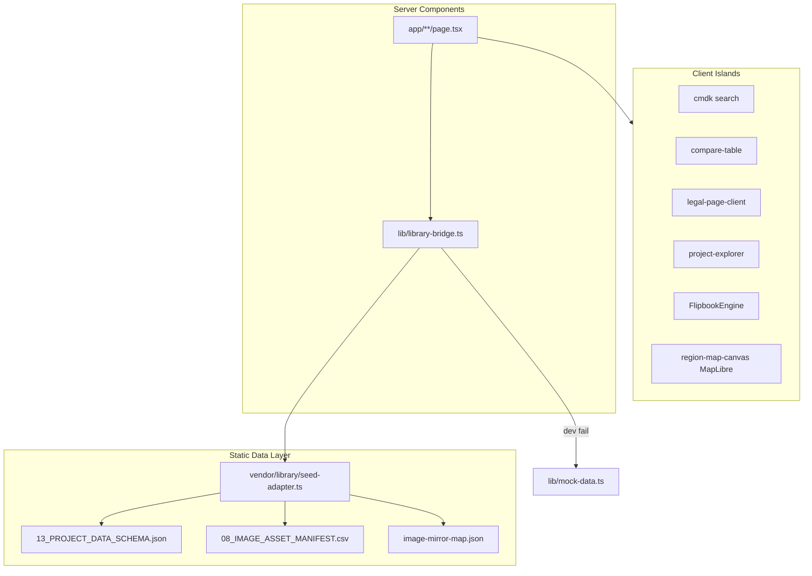

# Technical Due Diligence, Commercial Valuation & Productization Audit

**Repository:** `howtodonextcom-art/de-pmh-260723`  
**Audit date:** 2026-08-19  
**Method:** Source-code-first (Phase 1→2→3); docs cross-reference only after code  
**Auditor role:** Principal Architect + DD Analyst + PropTech Product Consultant  
**Confidence (valuation):** **Medium** — codebase fully local; production PDF function & image CDN completeness NOT VERIFIED

---

## 1. Executive verdict

**Repo này là gì:** Một **public read-only Next.js 16 catalog/internal hub** cho 4 dự án bất động sản Phú Mỹ Hưng — không phải CMS, không phải white-label platform, không có auth/admin/API. Dữ liệu đến từ **vendored JSON/CSV** (`vendor/data/`) qua `lib/library-bridge.ts`; UI gồm catalog, detail 13-block, compare matrix, legal dossier, MapLibre map, flipbook gallery, i18n vi/en, luxury QA pipeline.

**Maturity:** **62.5/100** (commercial/white-label lens) — functional cho 1 portfolio cụ thể, chưa sẵn sàng bán như platform.

**Strongest asset:** **Vendored data pipeline + compare/legal workflows** — `vendor/library/library/seed-adapter.ts`, `compare-fields.ts`, `fact-grid.ts`, `compare-table.tsx`, `legal-dossier-table.tsx` — schema-driven presentation của project data phức tạp (pháp lý, phân khu, status).

**Biggest weakness:** **~55–65% codebase bị khóa vào PMH/4 dự án** — nav taxonomy hardcoded, home content, image domains, i18n copy, seed JSON. **Không CMS/admin** → buyer mới project phải sửa file + redeploy.

**Current valuation (fair market, source license):** **$4k–8k USD** (~**95M–190M VND**)

**Achievable valuation (post white-label productization):** **$25k–50k USD** (~**600M–1.2B VND**) nếu hoàn thành content abstraction + admin + multi-project onboarding trong 6–9 tháng.

**Recommendation:** **Polish then productize, do not sell now at fire-sale.** Biến seed-adapter + compare/legal thành core IP; đừng bán như "website template". SaaS chỉ hợp lý sau Phase 3–5 (CMS + multi-tenant).

---

## 2. What the product actually is

*(From code, not README)*

| Fact | Evidence |
|------|----------|
| 6 public routes + `/lab` (noindex) | `app/page.tsx`, `du-an/`, `du-an/[slug]/`, `so-sanh/`, `phap-ly/`, `lab/page.tsx` |
| SSG from static seed at build | `generateStaticParams()` — `app/du-an/[slug]/page.tsx:22–24` |
| No middleware, no `app/api/` | Glob: 0 middleware, 0 route handlers |
| No auth/session | No next-auth/Clerk; `UserRole` types only — `vendor/library/types/project.ts:176–209` |
| Data: JSON + CSV + mirror map | `vendor/data/13_PROJECT_DATA_SCHEMA.json`, `08_IMAGE_ASSET_MANIFEST.csv` |
| Dev-only mock fallback | `lib/library-bridge.ts:35–47`; production throws |
| Optional external PDF | `pdf-export-trigger.tsx` → `NEXT_PUBLIC_PDF_FUNCTION_URL` — **NOT VERIFIED in repo** |
| Analytics | Vercel Analytics prod only — `app/layout.tsx:51` |

**One sentence:** Internal-facing **verified project data browser** for a fixed 4-project PMH portfolio, deployable as static marketing/catalog site.

---

## 3. Architecture map



| Layer | Stack | Quality |
|-------|-------|---------|
| Framework | Next.js 16 App Router, React 19 | Modern, appropriate |
| Styling | Tailwind 4, shadcn/base-ui primitives | Commodity + customized |
| Motion | Framer Motion, presets | Controlled |
| Maps | MapLibre GL, geojson overlay | Functional, not rebuilt |
| i18n | JSON files + client context | Split-brain server vi / client en |
| QA | Playwright e2e (10 specs) + luxury capture/score | Above average for template |
| Deploy | Vercel, pnpm, webpack dev | Standard |

---

## 4. Complete feature inventory

### A. Customer-facing (verified in code)

| Feature | Entry | Data source | Files |
|---------|-------|-------------|-------|
| Home hero cinematic | `/` | `buildSiteSettings` + assets | `components/home/hero.tsx`, `app/page.tsx` |
| Featured + catalog preview | `/` | `getFullCatalog()` | `featured-cards.tsx`, `explorer-preview.tsx` |
| Region map + filter links | `/` | `REGION_LNG_LAT` + geojson | `vn-map.tsx`, `region-map-canvas.tsx` |
| Updates feed | `/` | **Hardcoded** | `lib/home-content.ts:16–21` |
| Project catalog + filters | `/du-an` | JSON seed | `project-explorer.tsx` |
| Project detail 13 sections | `/du-an/[slug]` | JSON + assets | `app/du-an/[slug]/page.tsx:42–107` |
| Flipbook gallery | detail | ImageAsset[] | `gallery.tsx`, `components/flipbook/*` |
| Compare matrix (≤4 cols) | `/so-sanh` | `compare-fields.ts` | `compare-table.tsx` |
| Legal dossier browser | `/phap-ly` | `legalDossier` in JSON | `legal-page-client.tsx` |
| CMDK search | header | headerProjects | `components/shared/cmdk.tsx` |
| Theme + locale toggle | header | i18n JSON | `theme-toggle.tsx`, `locale-switcher.tsx` |
| PDF export / print | detail | print + optional URL | `pdf-export-trigger.tsx` |
| 404 / error branded | — | static | `not-found.tsx`, `error.tsx` |

### B. Marketing / CRO

| Feature | Status | Evidence |
|---------|--------|----------|
| JSON-LD Organization | ✅ Home only | `app/page.tsx:55–61` |
| SEO metadata per route | ✅ | `generateMetadata`, static exports |
| Sitemap / robots | ✅ | `app/sitemap.ts`, `app/robots.ts` |
| Lead capture forms | ❌ NOT PRESENT | No form submit handlers |
| Conversion tracking | ❌ | No GTM/GA events in code |
| CTA variety | Partial | Explore, compare, external project links |

### C. Sales enablement

| Feature | Status |
|---------|--------|
| Compare by zone/group | ✅ Functional |
| Legal doc viewer + copy | ✅ |
| Status badges + verification dates | ✅ `status-badge.tsx` |
| Fact grid / masterplan / amenities | ✅ Data-gated |
| PDF fact sheet | Partial (print default) |

### D. Content / CMS

| Feature | Status |
|---------|--------|
| Admin UI | ❌ |
| Content API | ❌ |
| WYSIWYG | ❌ |
| Media upload | ❌ (static manifest) |

### E. Internal operations

| Feature | Status |
|---------|--------|
| `/lab` demo shell | ✅ noindex |
| Luxury QA pipeline | ✅ `scripts/luxury/*` |
| Image mirror script | ✅ manual `mirror-project-images.mjs` |

### F. Platform infrastructure

| Feature | Status |
|---------|--------|
| Vendored `@library` alias | ✅ `next.config.mjs:37–45` |
| Mock dev fallback | ✅ |
| E2E tests | ✅ 10 specs |

### G. Developer tooling

| Feature | Status |
|---------|--------|
| `luxury:capture|diff|score` | ✅ |
| Archive audit scripts | Dead weight ~908 LOC |

### H. Experimental / incomplete

| Item | Evidence |
|------|----------|
| `UserRole`, `PendingChange`, `AuditLogEntry` | Types only — `project.ts:176–209` |
| `lib/geo/load-geojson.ts` | Zero app imports — stub |
| Nav "coming soon" placeholders | `project-nav-taxonomy.ts:50+` |
| Future Firestore note | Comment `lib/types.ts:8` — no implementation |

---

## 5. Module inventory (summary)

| Module | Path | Impl | Reuse | Coupling | Rec |
|--------|------|------|-------|----------|-----|
| library-bridge | `lib/library-bridge.ts` | Real | High | Medium | **Keep** — core gateway |
| seed-adapter | `vendor/library/library/seed-adapter.ts` | Real | High | Low | **Keep** — top IP |
| compare-fields | `vendor/library/lib/data/compare-fields.ts` | Real | High | Medium | **Keep** |
| compare-table | `components/project/compare-table.tsx` | Real | Medium | High | Refactor extract hooks |
| legal-dossier | `components/project/legal-dossier-table.tsx` | Real | Medium | High | Keep |
| flipbook stack | `components/flipbook/*` | Real | Medium | Low | Keep — differentiate |
| map-shell | `lib/map-shell/*` | Real | Medium | Medium | Keep |
| project-nav-taxonomy | `lib/project-nav-taxonomy.ts` | Real | Low | **Very high** | Refactor → config |
| home-content | `lib/home-content.ts` | Partial hardcode | Low | High | Refactor → CMS |
| mock-data | `lib/mock-data.ts` | Dev only | Low | PMH names | Keep for dev |
| demo-shell | `components/demo-shell.tsx` | Real | Low | Lab only | Archive optional |
| luxury scripts | `scripts/luxury/*` | Real | Medium | None | Keep |
| archive scripts | `scripts/archive/*` | Dead | None | None | **Remove/Archive** |

Full count: **~52 component files**, **~21 lib files**, **~15 app files**, **~10k LOC** (components+app+lib+scripts, excl. vendor).

---

## 6. Duplicate UI audit

| Pattern | Files | Difference | Merge? | Canonical | LOC save est. |
|---------|-------|------------|--------|-----------|---------------|
| Hero | `home/hero.tsx`, `detail/hero.tsx` | Full-bleed vs 60vh+badges | Partial variant | `HeroBlock variant=` | ~40 |
| Project card shell | `project-card.tsx`, `featured-cards.tsx` | Featured duplicates markup | Yes | Extend `ProjectCard` layout prop | ~45 |
| Motion reveal | `reveal.tsx`, `blur-fade.tsx` | Same viewportOnce pattern | Yes | Single `Reveal` with blur option | ~20 |
| Page shell | 5× `app/*/page.tsx` | SiteHeader + mock banner + main | Yes | `CatalogPageShell` | ~80 |
| Scope chip | `compare-table.tsx`, `legal-page-client.tsx` | **Identical** component | Yes | `components/shared/scope-chip.tsx` | ~50 |
| Nav zone rendering | `project-nav-dropdown.tsx`, `mobile-nav.tsx` | Parallel IA logic | Partial | Shared `NavZoneList` | ~60 |

**Proposed design system tree:**

```text
components/
  primitives/     # button, badge, tabs (existing ui/)
  blocks/         # ProjectCard, ScopeChip, ImageWithFallback
  sections/       # HeroBlock, StatStrip, GallerySection, MapSection
  project/        # detail/* (data-gated blocks)
  navigation/     # header, footer, nav-dropdown, mobile-nav
  forms/          # (empty — future)
  flipbook/       # signature viewer
```

---

## 7. Duplicate feature audit

| Capability | Locations | Proposed consolidation |
|------------|-----------|------------------------|
| Zone/group filter | compare, legal, explorer | `useNavScopeFilter()` hook |
| URL search param replace | compare, legal | `useReplaceSearchParams()` |
| heroAssetsBySlug builder | 3 app pages | `buildHeroAssetsBySlug()` in bridge |
| Legal row labels | `lib/types.ts` (dead), `legal-documents.ts`, vendor types | Single `legal-documents.ts` |
| i18n | `t.ts` (server vi-only) vs `locale-context` | Unified server+client locale |
| SEO title suffix | 6 pages | `seo.buildTitle()` helper |

---

## 8. Dead code / unnecessary complexity

| Item | LOC | Action | Evidence |
|------|-----|--------|----------|
| `scripts/archive/*` (9 files) | ~908 | REMOVE/Archive | Not in package.json |
| `lib/geo/*` | ~116 | REMOVE or wire | Zero imports |
| `LEGAL_DOSSIER_LABELS` in `lib/types.ts` | ~25 | REMOVE | No imports |
| `shadcn` npm dep | — | REMOVE from package.json | Zero imports |
| `luxury:qa` duplicate script | — | MERGE | Identical to `luxury:qa:auto` |
| `LegalTimeline` | ~35 | ARCHIVE with lab | Only `demo-shell.tsx` |

**Reducible without capability loss: 12–18%** (~1,050–1,800 LOC of ~10k).  
**Product React surface reducible: ~5–8%** — already lean on orphan components.

---

## 9. Hardcoded project dependencies

| Category | Examples | Lock-in |
|----------|----------|---------|
| **Brand** | "DED-PMH", teal oklch tokens | Medium — tokens abstractable |
| **Project data** | 4 slugs in JSON + mock | High — but JSON is intended seed |
| **Nav IA** | `PROJECT_NAV_ZONES` PMH plot codes | **Very high** — `project-nav-taxonomy.ts:50–120` |
| **Home content** | Updates, brand statement | **High** — `home-content.ts:16–31` |
| **Map coords** | `REGION_LNG_LAT` Bắc Ninh/HCM | High |
| **Image domains** | phumyhung.vn, honghacphumyhung.vn | Medium — config |
| **i18n** | PMH project names throughout vi/en.json | High |
| **Compare fields** | Domain-specific field matrix | Medium — schema is reusable |
| **SEO** | "Phú Mỹ Hưng" in descriptions | Medium |

**Hardcode lock-in estimate: ~55–65%** of *application logic* requires edit for a unrelated developer's project (nav + home + i18n + taxonomy).  
**Data layer** (`13_PROJECT_DATA_SCHEMA.json`) is *designed* for swap — **~35%** of effort is file replace; **~65%** is code/config/i18n/nav.

**Time to launch new project today (with developer):** **2–4 weeks** — edit JSON, CSV, mirror images, nav taxonomy, i18n, redeploy. **Not zero source edits.**

---

## 10. Top intellectual-property assets

| # | Asset | Replacement cost | Differentiation | Reusability | Monetization |
|---|-------|-----------------:|----------------:|------------:|-------------:|
| 1 | **Seed adapter + Project schema** | $8k–15k | High (domain) | High | License data layer |
| 2 | **Compare matrix engine** | $5k–10k | Medium-high | Medium | Agency sell-through |
| 3 | **Legal dossier UI + split logic** | $4k–8k | Medium | Medium | Compliance vertical |
| 4 | **Flipbook gallery viewer** | $3k–6k | Medium | Medium | Premium module |
| 5 | **Luxury QA capture/score pipeline** | $2k–4k | Low-medium | High | Dev tooling upsell |

**Category breakdown:**
- **A Reusable architecture:** library-bridge + seed-adapter pattern
- **B Business workflow:** compare + legal + status verification UX
- **C Proprietary:** flipbook integration, luxury score rubric
- **D Data model:** `vendor/library/types/project.ts` (rich RE schema)
- **E Automation:** luxury QA, image mirror script
- **F Conversion:** Weak — no leads/forms
- **G Content architecture:** Detail 13-block gated sections (good pattern)
- **H Integration:** MapLibre shell, optional PDF URL
- **I Deployment:** Standard Vercel — commodity

---

## 11. Technical quality

| Area | Score 1–5 | Notes |
|------|-----------|-------|
| Type safety | 4 | TS strict; `ignoreBuildErrors: false` — `next.config.mjs:6–8` |
| Component hygiene | 5 | 0 unused components |
| Server/client split | 4 | Appropriate RSC + islands |
| Error handling | 3 | Production hard-fail on missing seed; generic empty states |
| Performance | 4 | SSG, image priority, unoptimized images tradeoff |
| Accessibility | 4 | Focus rings, flipbook dialog, aria on map |
| Test coverage | 3 | 10 e2e, no unit tests |
| Security | 3 | Public read-only; no OWASP surface but no auth model |
| Maintainability | 3 | Duplication in filters/shells; large mock file |

---

## 12. Product maturity score /100

| Category | Max | Score | Evidence |
|----------|----:|------:|----------|
| Product completeness | 10 | **7** | 4 projects E2E functional; no admin |
| Architecture | 10 | **7** | Clean App Router; vendored data |
| Code quality | 10 | **7** | No orphan components; some dup |
| UX | 8 | **5.5** | LuxuryIndex 85, Perceived 6.5 — `reports/2026-08-19-luxury-full-audit.md` |
| Design system | 7 | **5** | shadcn + fragments, no blocks layer |
| Data architecture | 8 | **5** | Rich schema, static files only |
| CMS/customization | 8 | **1.5** | Must edit JSON/code |
| Security | 6 | **4** | Public OK; no auth for future admin |
| SEO | 6 | **5** | sitemap, robots, metadata, JSON-LD partial |
| Analytics | 5 | **2** | Vercel Analytics only |
| Testing | 6 | **4.5** | 10 e2e + luxury QA |
| DevOps | 5 | **4** | Vercel deploy; PW_CHANNEL capture workaround |
| Documentation accuracy | 3 | **2** | Many reports; some stale vs code |
| Reusability | 4 | **1.5** | PMH-locked nav/home/i18n |
| Commercial readiness | 4 | **1.5** | Not white-label |
| **TOTAL** | **100** | **62.5** | |

---

## 13. Current valuation

**Confidence: Medium** — local code complete; buyer market prices subjective; PDF prod NOT VERIFIED.

### Method A — Replacement cost

| Market | Hours est. | Rate | Range |
|--------|------------|------|-------|
| VN agency | 350–550h | $18–35/h | **$6k–19k** |
| Regional outsource | 300–450h | $25–45/h | **$8k–20k** |
| International | 250–400h | $60–120/h | **$15k–48k** |

*Includes: Next app, compare, legal, map, flipbook, i18n, e2e, data pipeline. With AI assist: −30–40% hours.*

### Method B — Code asset value

| Class | % of codebase | Transferable value |
|-------|---------------|-------------------|
| Reusable (seed-adapter, compare, flipbook, map-shell) | ~35% | **High** |
| Product-specific (PMH nav, home, i18n copy) | ~40% | **Low** |
| Commodity (shadcn, Next boilerplate) | ~20% | **None** |
| Dead/archive scripts | ~5% | **Negative** |

**Transferable asset value:** **$3k–12k** depending on buyer needs.

### Method C — Product value (PropTech deployment)

| Factor | Score | Impact |
|--------|-------|--------|
| Deploy readiness (1 project) | 8/10 | Vercel-ready |
| New project without code | 2/10 | Requires dev |
| Scalability | 3/10 | Static SSG |
| Admin | 0/10 | None |
| Onboarding time | 2–4 weeks | With experienced dev |

**Product value today:** **$5k–12k** to buyer needing PMH-style internal hub.

### Method D — Commercial value by buyer

| Buyer | Max rational price | Why pay | Discount |
|-------|-------------------|---------|----------|
| Freelancer / small agency | **$1.5k–4k** | Compare+legal modules | No CMS, PMH lock-in |
| VN digital agency | **$4k–10k** | Flipbook + QA pipeline + RE schema | Must refactor for clients |
| RE marketing agency | **$6k–15k** | Domain workflows | No lead capture |
| Property developer | **$3k–8k** | Internal data hub pattern | Single-tenant only |
| PropTech startup | **$8k–20k** | Schema + seed adapter head start | Rebuild CMS anyway |
| International agency | **$10k–25k** | Quality UX baseline | i18n partial, VN-specific |

### Valuation ranges

| Scenario | USD | VND (×24,000) |
|----------|-----|---------------|
| **Fire-sale** | **$1.5k–3k** | **36M–72M** |
| **Fair market** | **$4k–8k** | **95M–190M** |
| **Strategic buyer** (RE agency VN) | **$8k–15k** | **190M–360M** |
| **Productized** (post white-label) | **$25k–50k** | **600M–1.2B** |
| **SaaS/IP platform** | **$80k–150k+** | **1.9B–3.6B+** |

---

## 14. Why the repo is worth that amount

**Buyer thực sự mua:**

1. **~10k LOC working Next.js 16 app** — không phải Figma, không phải half-done
2. **Domain-rich Project schema** — legal dossier, subdivisions, compare fields, status verification — tiết kiệm 4–8 tuần modeling
3. **Compare + legal UX** — hiếm trong template $50–200
4. **Flipbook gallery** — differentiated media experience
5. **MapLibre integration** với geojson overlay
6. **Luxury QA pipeline** — reproducible UI regression
7. **10 e2e specs** — giảm regression risk
8. **Production deploy** proven — `de-division-pmh.vercel.app`

**Không mua:** CMS, multi-tenant, leads, admin, AI, white-label onboarding.

---

## 15. What is preventing higher valuation

| Destroyer | Valuation impact est. |
|-----------|---------------------|
| No CMS/admin — must edit code/JSON | **−35%** |
| PMH hardcode (nav, home, i18n) | **−25%** |
| No lead capture / CRM | **−15%** |
| Static SSG only — no dynamic multi-project | **−15%** |
| Split i18n (server vi / client en) | **−5%** |
| No auth despite future types | **−5%** |
| Archive script bloat | **−3%** |
| `images.unoptimized: true` | **−3%** |
| Documentation sprawl / stale reports | **−2%** |

---

## 16. White-label architecture (target state)

```text
Platform
├── organizations (tenant)
│   ├── projects[]
│   │   ├── branding (theme tokens)
│   │   ├── content (sections/blocks JSON)
│   │   ├── units / subdivisions
│   │   ├── media library
│   │   ├── legal documents
│   │   ├── compare config
│   │   └── domain + deployment
│   └── users / roles
└── shared modules (compare engine, flipbook, map-shell, luxury QA)
```

**Migration from current:** Extract `PROJECT_NAV_ZONES` → DB/config; `buildUpdates`/`buildSiteSettings` → CMS; seed JSON → import API; keep detail block components as **section renderers**.

---

## 17. Admin / CMS architecture (design)

```text
/admin
  Dashboard          — projects count, last verified, deploy status
  Projects           — CRUD + clone
  Pages              — block ordering per route
  Content            — section editor (Hero, Overview, Legal...)
  Properties         — units, subdivisions, amenities
  Media              — upload, alt, categories
  Leads              — (future) form submissions
  Compare config     — field matrix per org
  SEO                — metadata per page/project
  Users              — role-based (types exist in project.ts)
  Domains            — custom domain mapping
  Settings           — brand tokens, integrations
```

**Current gap:** 100% missing — types `UserRole`/`PendingChange` are schema placeholders only.

---

## 18. Content & media customization system

**Section schema (target):**

```typescript
interface PageSection {
  sectionType: "hero" | "overview" | "gallery" | "map" | "legal" | "compare" | ...
  title?: string
  eyebrow?: string
  description?: string
  media?: MediaRef[]
  layout?: "fullBleed" | "contained" | "split"
  theme?: "default" | "dark" | "accent"
  visibility: boolean
  order: number
  cta?: { label: string; href: string }
}
```

**Map current detail blocks → section types:** `DetailHero`→hero, `DetailGallery`→gallery, etc. — `app/du-an/[slug]/page.tsx:90–107`.

**Media library:** Replace CSV manifest with S3/R2 + CDN; keep `image-verify-report` concept for SAFE/RISKY classification.

---

## 19. Proposed database schema (conceptual)

Core tables: `organizations`, `projects`, `project_sections`, `subdivisions`, `units`, `amenities`, `legal_documents`, `media_assets`, `compare_field_definitions`, `seo_metadata`, `users`, `roles`, `domains`, `deployments`, `audit_log` (aligns with existing `AuditLogEntry` type).

**Key:** `projects.organization_id` + `projects.slug` replaces vendored JSON file per project.

---

## 20. Recommended component architecture

Refactor toward:

```text
components/blocks/     HeroBlock, GalleryBlock, MapBlock, CompareBlock, LegalBlock
components/sections/   PageSectionRenderer (maps sectionType → block)
components/project/    Keep detail blocks as block implementations
lib/content/           getProjectSections(projectId) — replaces inline page composition
```

**Do not rewrite flipbook/map/compare** — wrap as blocks.

---

## 21. SaaS transformation

| Requirement | Current | Gap |
|-------------|---------|-----|
| Multi-tenant | ❌ | Org model + RLS |
| Billing | ❌ | Stripe |
| Self-serve signup | ❌ | Auth + onboarding wizard |
| Per-project domain | ❌ | Vercel/domains API |
| Usage metering | ❌ | Analytics pipeline |

**Realistic SaaS timeline:** 12–18 months post productization. **Not recommended as first move.**

---

## 22. Commercial packaging

### Option A — Source Code License ($4k–15k)

Single buyer, fork allowed, no SaaS rights. **Matches current state.**

### Option B — White-label Platform License ($25k–50k)

Multi-project, admin included, annual support. **Requires Phase 2–4.**

### Option C — SaaS ($99–499/mo)

Starter: 1 project · Pro: 5 projects · Agency: 25 · Enterprise: custom domain + SLA.

---

## 23. Buyer personas

| Persona | WTP | Primary value | Deal breaker |
|---------|-----|---------------|--------------|
| VN RE marketing agency | $6k–15k | Compare+legal+flipbook | No CMS |
| PropTech startup | $10k–25k | Data schema head start | Rebuild multi-tenant |
| Freelancer | $1.5k–4k | Next.js starter | PMH lock-in |
| Property developer | $3k–8k | Internal hub | Needs lead forms |
| International agency | $10k–25k | UX quality | VN-specific content |

---

## 24. $1k → $100k roadmap

| Target | Required capabilities | Buyer accepts because |
|--------|----------------------|------------------------|
| **$1k** | As-is source zip | Cheaper than 1 week dev time |
| **$5k** | + Cleanup + docs + remove archive + basic config file for brand colors | "Production-ready fork" |
| **$10k** | + JSON-driven nav/home + unified i18n + onboarding doc | New project in 1 week not 4 |
| **$25k** | + Admin CMS (content sections) + media upload + 1-click deploy | Agency resells to 3+ clients |
| **$50k** | + Multi-project + custom domain + lead forms + template picker | Platform license |
| **$100k+** | + Multi-tenant SaaS + AI import + billing + SLA | Recurring revenue business |

---

## 25. Valuation uplift roadmap

| Upgrade | Effort | Value lift |
|---------|--------|------------|
| Remove dead scripts + shadcn dep | S | +3–5% |
| Extract ScopeChip + page shell + heroAssets helper | S | +5% |
| Config-driven nav (YAML/JSON not TS) | M | +10–15% |
| CMS for home + updates + brand statement | M | +15–20% |
| Admin media library | L | +20–25% |
| Multi-project + org model | L | +30–40% |
| Lead capture + CRM webhook | M | +10% |
| AI PDF/brochure import (human review) | M | +15% (strategic buyers) |

---

## 26. 30 / 60 / 90 day action plan

### Days 1–30 (Cleanup + config)

- Remove `scripts/archive/`, `lib/geo/*`, unused type exports, `shadcn` dep
- Extract `ScopeChip`, `CatalogPageShell`, `buildHeroAssetsBySlug`
- Move `PROJECT_NAV_ZONES` to `config/nav.json`
- Document "new project checklist" with file list

### Days 31–60 (Content abstraction)

- Externalize `buildUpdates`, `buildSiteSettings`, `REGION_LNG_LAT` to config
- Unified i18n (server reads locale cookie/header)
- Block registry prototype for detail page
- Capture flipbook in luxury pipeline

### Days 61–90 (Commercial MVP)

- Admin MVP: project JSON editor + media manifest upload
- Lead form block (webhook)
- Template: "Luxury Internal Hub" vs "Catalog Compare"
- Package demo with 2nd fake project proving swap

---

## 27. Final recommendation

> **Nếu đây là tài sản của tôi: Polish → productize → license, không bán fire-sale, chưa SaaS.**

| Path | Verdict |
|------|---------|
| **Sell now** | Chỉ nếu cần cash nhanh — fire-sale **$1.5k–3k** |
| **Polish then sell** | **Recommended** — 2–3 tháng → fair **$8k–15k** strategic |
| **Build SaaS** | Chỉ nếu có distribution (agency clients) — 12+ tháng |

**Moat truth:** Repo có **implementation effort** (~350–550h) và **domain workflow knowledge**, không có **defensible moat**. Senior dev + AI tái tạo 80% trong **3–6 tuần**. Giá trị thật nằm ở **compare/legal schema + flipbook + QA pipeline** — gom và productize các phần đó, không bán "website PMH".

---

## Appendix A — Acquisition perspective (buyer POV)

**Assets nhận được:** Working RE catalog, compare, legal viewer, flipbook, map, e2e, luxury QA, rich Project TypeScript schema.

**Risks nhận luôn:** PMH lock-in, no CMS, static data, split i18n, optional PDF external dep, image licensing unverified.

**Vẫn phải tự xây:** Admin, multi-project, leads, auth, billing, content editor, media CDN, white-label onboarding.

**Trả thêm vì:** Compare matrix + legal dossier UX + data schema maturity.

**Ép giá vì:** Commodity Next/shadcn stack, no moat, 2–4 week fork cost for competitor.

---

## Appendix B — Competitive benchmark (architecture-level)

| Dimension | de-pmh-260723 | WP RE theme ($60) | Webflow template ($80) | Custom agency build |
|-----------|---------------|-------------------|--------------------------|---------------------|
| Compare matrix | ✅ Strong | Rare | ❌ | $$$ custom |
| Legal dossier | ✅ Strong | ❌ | ❌ | $$$ custom |
| CMS | ❌ | ✅ | ✅ | ✅ |
| Multi-project | ❌ | ❌ | ❌ | ✅ |
| Flipbook gallery | ✅ | ❌ | ❌ | Rare |
| MapLibre | ✅ | Plugins | Embed | Custom |
| White-label | ❌ | N/A | N/A | ✅ |
| Time new project | 2–4 weeks | Days | Days | 2–3 months |

---

## Appendix C — WHAT NOT TO BUILD (early)

| Feature | Why skip |
|---------|----------|
| Full AI content generator | Low trust in RE legal; liability |
| Custom MapLibre rebuild | Frozen; working |
| Firebase/Algolia port | Over-engineering vs JSON |
| Page transition luxury (B4) | Low valuation lift |
| Native mobile app | Out of scope |
| Blockchain / NFT property | Zero buyer demand |
| Complex RBAC before CMS | No admin yet |

---

## Appendix D — Commands & artifacts

```bash
# Structure verified via glob + read
# LOC est: ~9176 (components+app+lib+scripts ts/tsx/mjs)
# Luxury cross-ref: reports/2026-08-19-luxury-full-audit.md
# Capture: PW_CHANNEL=chrome npm run luxury:capture (2026-08-19)
```

### NOT VERIFIED

1. Production PDF Cloud Function deployment
2. Complete image mirror / CDN coverage for all assets
3. Full contents of `13_PROJECT_DATA_SCHEMA.json` (4 projects assumed from code comments + mock parity)
4. Image licensing for all remote PMH URLs
5. Vercel Analytics data / conversion metrics

---

*End of audit — no code changes made in this wave.*
