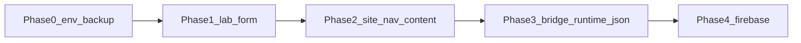

# Env contract + de-hardcode roadmap

**Date:** 2026-08-27  
**Wave:** Phase 0 (shipped this commit-set)  
**Backend lock:** local JSON / files. Firebase is **deferred** to Phase 4.  
**Do not commit:** `.env.local`, `service.json`

---

## 1. Current state (after Phase 0)

| Item | Status |
|------|--------|
| Env contract | `.env.example` + typed `lib/config/env.ts` (public) / `lib/config/env.server.ts` (secrets) |
| `.env.local` | KEY=value (gitignored). Firebase keys stored for Phase 4, **SDK not imported** |
| `service.json` | gitignored; path via `GOOGLE_APPLICATION_CREDENTIALS=./service.json` |
| Seed backup | `npm run backup:seed` → `backups/seed-<timestamp>/` |
| Catalog runtime | still `vendor/data` via `lib/library-bridge.ts` (fail-closed in production) |
| Admin form | **not built** (Phase 1) |

Public env keys in use:

- `NEXT_PUBLIC_SITE_NAME` — wired into root layout title
- `NEXT_PUBLIC_SITE_URL`
- `NEXT_PUBLIC_BRAND_SHORT`
- `NEXT_PUBLIC_PDF_FUNCTION_URL` — wired via `publicEnv` in `pdf-export-trigger.tsx`

---

## 2. Modules still hardcoded (dehardcode map)

| Module | Path | What is locked | Target phase |
|--------|------|----------------|--------------|
| Site copy / updates | `lib/home-content.ts` | Brand paragraph + 3 update rows | 2 |
| Map pins | `lib/home-content.ts` `REGION_LNG_LAT` | Bắc Ninh / TP.HCM coords | 2 |
| Nav IA | `lib/config/site-nav.ts` | PMH plot codes, coming-soon leaves | 2 |
| Catalog seed | `vendor/data/13_PROJECT_DATA_SCHEMA.json` | 4 projects | 1 + 3 |
| Image manifest | `vendor/data/08_IMAGE_ASSET_MANIFEST.csv` | remote URLs + ids | 1 + 3 |
| Image mirror | `vendor/data/image-mirror-map.json` + `public/vendor-images/` | local logos | 1 |
| Remote image hosts | `next.config.mjs` `images.remotePatterns` | phumyhung.vn, honghacphumyhung.vn | 2 |
| Sa bàn CTA | `components/home/vn-map.tsx` | bacninhhonghaccity.vn URL | 2 |
| Dev mock | `lib/mock-data.ts` | PMH names + source URLs | 3 (keep as last-resort dev) |
| i18n project names | `lib/i18n/vi.json`, `lib/i18n/en.json` | display strings | 2 |
| Compare fields | `vendor/library/lib/data/compare-fields.ts` | domain columns (reusable) | keep schema; data from JSON |
| Bridge | `lib/library-bridge.ts` | vendor-only load | 3 |

---

## 3. Phases



### Phase 0 — now (this wave)

Env contract, secret hygiene, seed snapshot. Persistence: files.

### Phase 1 — Admin form `/lab/projects`

- Lab-only route (already noindex). No public CMS, no auth yet — `/lab` stays unlinked from public nav.
- Form CRUD for **one project at a time** matching `13_PROJECT_DATA_SCHEMA.json` fields the UI already renders (slug, display names, status, legal dossier strings, image URL/path list).
- Persist to `data/runtime/projects.json` (gitignored).
- Export zip: JSON + image list, so operators can re-import later.
- Import path: restore from `backups/seed-*` JSON/CSV.

### Phase 2 — Site chrome from the same JSON

- Move `SITE_CONTENT` and `PROJECT_NAV_ZONES` into `data/runtime/site.json` (typed `SiteContent` + nav).
- `REGION_LNG_LAT` and sa-bàn URL become site config, not source constants.
- Optional: `NEXT_PUBLIC_IMAGE_HOSTS` or config JSON for `remotePatterns` (Next config cannot read JSON at request time — generate `next.config` from env list or a committed `lib/config/image-hosts.ts` filled by the form export).

### Phase 3 — Bridge reads runtime first

- `library-bridge.ts`: if `data/runtime/projects.json` exists and parses, use it; else vendor seed; production still fail-closed if neither is valid.
- Keep mock-data for local-only empty vendor.

### Phase 4 — Firebase (deferred)

- Client: `getFirebaseClientEnv()` already typed.
- Admin: `getFirebaseAdminEnv()` + `service.json` via `GOOGLE_APPLICATION_CREDENTIALS`.
- Firestore collections for projects/assets; Storage for scans/gallery.
- **Do not start Phase 4 until Phase 1–3 are stable.** Adding the SDK now would lock the catalog to a vendor before the form/schema is proven.

---

## 4. Backup / restore (operators)

```bash
npm run backup:seed
```

Creates `backups/seed-<timestamp>/` with schema JSON, CSV, mirror map, verify report, and `public/vendor-images/`. See `backups/README.md` and `RESTORE.txt` inside each snapshot.

Restore: copy those folders back onto the repo paths, then restart the dev server.

---

## 5. Security notes

- `.gitignore` now ignores `service.json`, `credentials/*.json`, `.env*` (except `.env.example`), `data/runtime/`, `backups/seed-*/`.
- Never put `FIREBASE_PRIVATE_KEY` in `NEXT_PUBLIC_*`.
- Rotate the Admin key if `service.json` was ever committed or pasted into a ticket.
